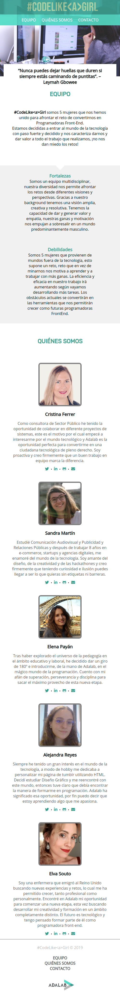
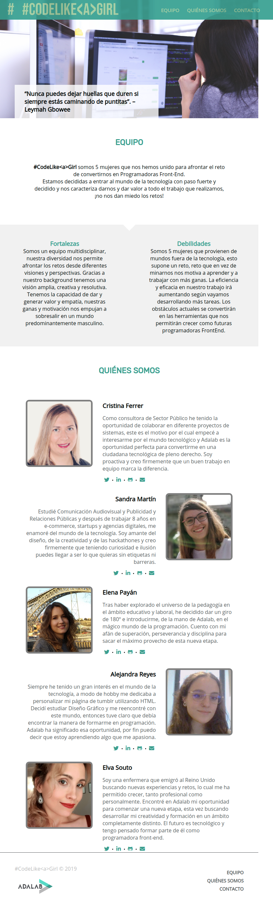
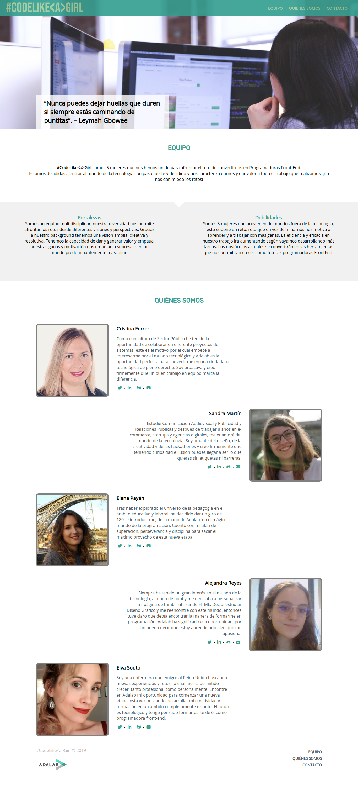

###CodeLike<a>Girl

Es el proyecto grupal del primer módulo del curso Programación Front-end de Adalab. Se trata de una página web colaborativa a modo CV online en el que las 5 personas que formamos el equipo detallamos:

- De dónde venimos
- Nuestras razones para convertirmos en programadoras
- Nuestras redes sociales
- Un formulario de contacto para que se pongan en contacto con nosotras

##Para acceder a la página web, entrar en: http://beta.adalab.es/project-promo-h-module-1-team-1-morning/

La página web es **responsive** y el diseño está adaptado a tres tamaños de dispositivos: **móvil, tablet y ordenador**.

La página cuenta con un navegador que dirige a tres secciones principales:

**Equipo**: una descripción general sobre los valores de nuestro equipo. **Quiénes somos**: ficha personal de cada miembro del equipo con foto, nombre, biografía y links a las redes sociales. **Contacto**: formulario con campos obligatorios para enviarnos un email.

Además, en la home, aparecen más apartados como:

**Header**: con el logo del equipo y las opciones de navegación. En móvil, el navegador se desplaza hacia abajo para aprovechar el espacio disponible y mantener un tamaño óptimo de tipografía y accesibilidad de los botones. **Hero**: banner con dos imágenes que se animan al acceder a la web y una frase inspiradora a modo de claim o lema del equipo. **Fortalezas y debilidades:** un listado sobre nuestros puntos fuertes y aquellas cosas que debemos mejorar para convertirnos en programadoras. **Footer**: copyright, logo de Adalab y opciones de navegación con hover.

**Contacto** y **Home** son dos archivos HTML diferentes que comparten algunos partials como header y footer pero con un hero y un main personalizados.

El proyecto está creado con **HTML, Sass, Gulp, Git y GitHub**.

Hemos realizado una estructura de carpetas mediante partials para conseguir que la web se cargue más rápido en diferentes dispositivos.

  
